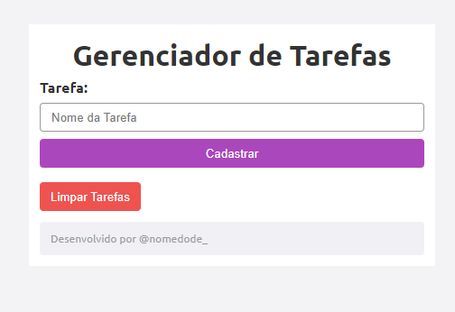
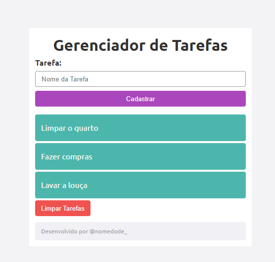

# ToDoList

𝐍𝐨𝐰 𝐥𝐨𝐚𝐝𝐢𝐧𝐠...

# Índice🗝️
   - [trabalho de recuperação - Gerenciador de Tarefas ](#trabalho-de-recupera%C3%A7%C3%A3o----Gerenciador de Tarefas)  
   - [Descrição](#descri%C3%A7%C3%A3o)  
   - [Introdução](#introdu%C3%A7%C3%A3o)  
   - [Funcionalidades](#funcionalidades)
   - [codigos](#codigos)
   - [Tecnologias Utilizadas](#tecnologias-utilizadas)  
   - [Fontes Consultadas](#fontes-consultadas)  
   - [Autores](#autores)

### Descrição

O projeto consiste em criar um sistema de gerenciamento de tarefas, permitindo que os usuários adicionem, visualizem e atualizem suas tarefas. Ele utiliza uma abordagem  
monolítica, onde todas as funcionalidades estão contidas em um único processo.

### Funcionalidades

1. **Adicionar Tarefa**: Os usuários podem adicionar novas tarefas especificando um título, descrição, status e prazo.

2. **Visualizar Tarefas**: A lista de tarefas é exibida na página inicial, mostrando os detalhes de cada tarefa.

3. **Detalhes da Tarefa**: Os usuários podem clicar em uma tarefa para ver seus detalhes, incluindo título, descrição, status e prazo.

4. **Atualizar Tarefa**: Os usuários podem marcar uma tarefa como concluída ou alterar seus detalhes.

### Tecnologias Utilizadas

O projeto utiliza as seguintes tecnologias:

- **PHP**: A linguagem de programação principal para criar o sistema monolítico.
- **HTML5 e CSS3**: Para a interface do usuário e a estrutura da página.
- **MySQL (ou outro banco de dados)**: Para armazenar as informações das tarefas.

### Recursos da Linguagem PHP Utilizados no Projeto

Aqui estão alguns dos recursos da linguagem PHP que o autor do vídeo utiliza:

1. **isset**: A função `isset()` verifica se uma variável está definida e não é nula. É comumente usado para verificar se os parâmetros de solicitação (como dados de formulário) foram enviados.

2. **$_SESSION**: A variável global `$_SESSION` é usada para armazenar dados de sessão entre diferentes páginas. Ela permite que você compartilhe informações entre solicitações do usuário.

3. **foreach**: O laço `foreach` é usado para iterar sobre elementos de um array ou objetos iteráveis. No contexto do projeto, provavelmente é usado para percorrer as tarefas armazenadas.

4. **session_start()**: Essa função inicia uma sessão PHP. É necessário chamar `session_start()` antes de usar a variável `$_SESSION`.

5. **array()**: Arrays são estruturas de dados que armazenam múltiplos valores em uma única variável. No projeto, eles podem ser usados para armazenar tarefas e seus detalhes.

6. **$_GET**: A variável global `$_GET` contém os parâmetros passados na URL. É usado para obter informações da URL, como o ID de uma tarefa específica.

7. **array_push()**: Essa função adiciona um ou mais elementos ao final de um array. No contexto do projeto, pode ser usado para adicionar novas tarefas à lista.

8. **var_dump()**: A função `var_dump()` exibe informações sobre uma variável, incluindo seu tipo e valor. É útil para depuração.

9. **unset()**: A função `unset()` remove uma variável ou um elemento de um array. Pode ser usado para excluir tarefas concluídas ou remover elementos indesejados.

### Créditos e Fontes

O código deste projeto foi criado pelo canal Monolito PHP¹[1].

[Monolito PHP's GitHub Repository](https://github.com/vilsonsampaio/task-manager)
- [Sistema simples de gerenciamento de tarefas com testes automatizados](https://github.com/walterhml/simple-task-management-system-with-php)
- [Gerenciador simples de tarefas usando conexão com banco de dados MySQL](https://github.com/felipetulio/gerenciador-tarefas-simples)
- [Aplicação de gerenciador de tarefas utilizando HTML, CSS e PHP](https://github.com/emilypessoa/GerenciadorDeTarefas)
- [Inteligência Artifcial](https://chat.openai.com/)
-[alura](https://www.alura.com.br/artigos/escrever-bom-readme?utm_term=&utm_campaign=&utm_source=adwords&utm_medium=ppc&hsa_acc=7964138385&hsa_cam=20946398532&hsa_grp=153091871930&hsa_ad=688089973825&hsa_src=g&hsa_tgt=dsa-2258482177123&hsa_kw=&hsa_mt=&hsa_net=adwords&hsa_ver=3&gad_source=1&gclid=Cj0KCQjwncWvBhD_ARIsAEb2HW8ijk7NVhpuiVanaYEGFFOvZkBpjlnMcjF5Wcw-slwIVdYTzACJOG4aAiywEALw_wcB)
-[Microsoft Bing](https://www.bing.com/chat?q=Microsoft+Copilot&FORM=hpcodx)

### Link para o Vídeo Tutorial

Assista ao tutorial completo no YouTube: [Projeto - Gerenciador de Tarefas](https://www.youtube.com/watch?v=dJ49I-QYYUk)¹[1].

###AUTORES

Nicolly da Silva D'avila 3*A
